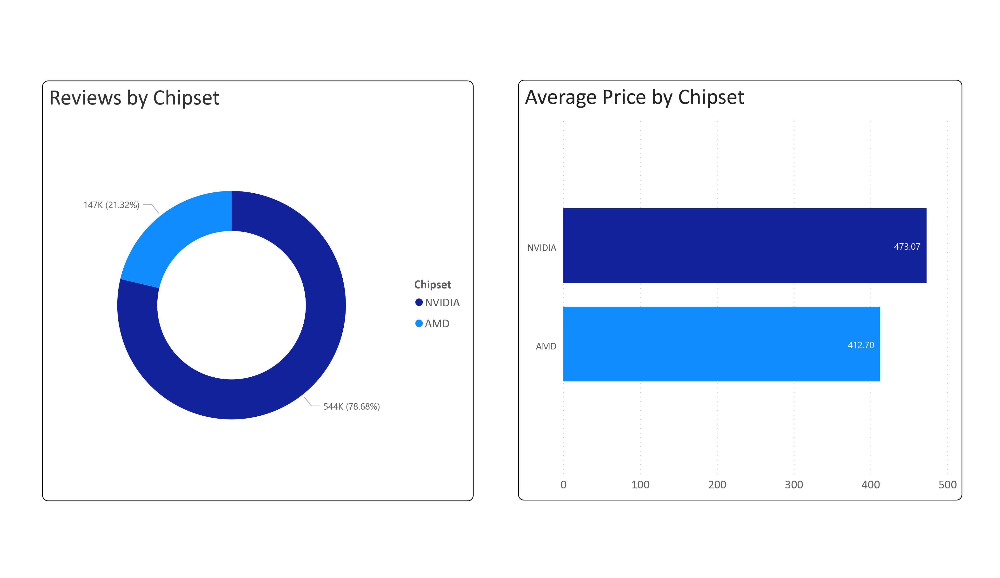
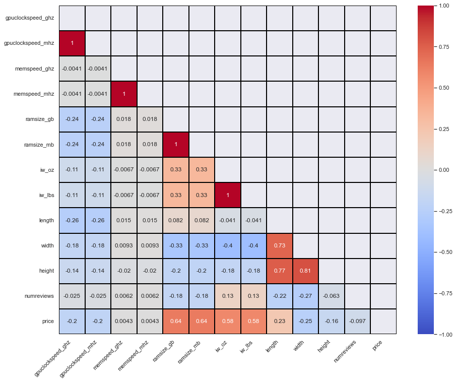

# GPU Project

Predicting Graphics Processing Unit (GPU) prices using data scraped from different sources (Newegg, Amazon)

## Questions about GPU Prices

- How does the brand and manufacturer impact the price of a GPU?
- Are there any significant differences between high-end and mid-range GPUs that justify the price difference?
- How does the competition between GPU manufacturers impact the prices of their products?

## Background
New graphics cards have come out, such as the new RTX 40 series with the GeForce RTX 4080 & 4090 graphics cards. If you <a target="_blank" href="https://store.nvidia.com/en-us/geforce/store/?page=2&limit=9&locale=en-us&gpu=RTX%204090&category=GPU,DESKTOP"> click this link </a> you can see the top listed product has been sold out (and possibly the other ones too).

As of this commit, the 4090 graphics cards are up-to-date with being the most high performing graphics cards for gaming, video editing, and cryptocurrency mining. Older gpus have dropped in price giving people a chance to buy within their budget. I wanted this project to be about gpus because of my interests in them (I've built a PC before) without using a completed dataset, found from Kaggle, but to create my own dataset.

## Data Collection / Gathering
Data scraped from Newegg was done through building a web scraper using <a target = '_blank' href = 'https://scrapy.org/'> Scrapy </a> within the data directory, and stored within 'gpu_data.db' used for visualizations. 

Data scraped from Amazon was done using <a target = '_blank' href = 'https://webscraper.io/'> webscraper.io </a>. The data from Amazon is stored in a .csv file, but has been imported into a PostgreSQL database because it needs to be clean & used to build visualizations & for model building.

## Data Pre-Processing
##### Note: This only applies for the file 'gpu_data.csv'.

Procedure is shown and reasons are explained down below:

    1. Column Selection (using SQL)
        - Data scraped from Amazon contains unnecessary columns that are not relevant & useful
    
    2. Inputting data for GPU brand & chipset
        - We'll include as many brands as possible to prevent any loss of information
        - Data in the 'chipmanu' column has been scraped incorrectly and we'll only include NVIDIA & AMD

    3. Synthesizing New Columns
        - There are different values in some of our columns such as: GB & MB, GHz & MHz, lbs & oz in one column
        - We should make columns that place the units in separate columns based on unit measures

    4. Dropping Missing values (Easy) & 'Mislabled' values (Hard)
       - There are specific missing rows which need to be removed because some of the rows have been incorrectly scraped
       - Some values in 'gpuclockspeed' & 'memoryspeed' don't have MHz or GHz. We'll drop the rows that don't contain the unit measures

    5. Change column types
        - Most columns have 'object' data types, and we need to change them accordingly
            - Synthesizing new colmuns would require changing some data types into 'float64' and 'int64'

    6. Re-arrange columns
        - 'price' column will be our label for modeling, and the rest will be features for other purposes (visualizaitons, feature engineering etc.)

## Data Visualization

### Data can be visualized to draw insights from our dataset.

💡 Here we can see there is more feedback about NVIDIA graphics cards. This means that people who bought their graphics cards from NVIDIA are more likely to place a review about the product than buying AMD garphics cards. The price of NVIDIA cards, which are higher than AMD, imply that people will likely buy their graphics cards from NVIDIA, so they can get their money's worth since higher reviews on a product show that customers are more likely to buy them.

### We can plot a correlation matrix showing correlations between the features & label(s) shown below:

💡 There is a positive correlation with the price and the ramsize which means that a higher ram size indicates a higher price of the graphics card. 

## Machine Learning 

This section will involve using machine learning to predict the price of a graphics card given variables like the number of reviews, graphics card brand, the chipset manufacturer, and much more.

This will be a regression problem because we are outputting a continuous value from our label (being price).

The algorithm we'll use for our regression model will be XGBoost. This will be our baseline model because it won't be prone to overfitting, and we can make further adjustments to our machine learning model.

Before we do that, we would need to first make some changes to our features, so our machine learning model can achieve a higher performance...

Project Organization
------------

    ├── LICENSE
    ├── Makefile           <- Makefile with commands like `make data` or `make train`
    ├── README.md          <- The top-level README for developers using this project.
    ├── data
    │   ├── external       <- Data from third party sources.
    │   ├── interim        <- Intermediate data that has been transformed.
    │   ├── processed      <- The final, canonical data sets for modeling.
    │   └── raw            <- The original, immutable data dump.
    │
    ├── docs               <- A default Sphinx project; see sphinx-doc.org for details
    │
    ├── models             <- Trained and serialized models, model predictions, or model summaries
    │
    ├── notebooks          <- Jupyter notebooks. Naming convention is a number (for ordering),
    │                         the creator's initials, and a short `-` delimited description, e.g.
    │                         `1.0-jqp-initial-data-exploration`.
    │
    ├── references         <- Data dictionaries, manuals, and all other explanatory materials.
    │
    ├── reports            <- Generated analysis as HTML, PDF, LaTeX, etc.
    │   └── figures        <- Generated graphics and figures to be used in reporting
    │
    ├── requirements.txt   <- The requirements file for reproducing the analysis environment, e.g.
    │                         generated with `pip freeze > requirements.txt`
    │
    ├── setup.py           <- makes project pip installable (pip install -e .) so src can be imported
    ├── src                <- Source code for use in this project.
    │   ├── __init__.py    <- Makes src a Python module
    │   │
    │   ├── data           <- Scripts to download or generate data
    │   │   └── make_dataset.py
    │   │
    │   ├── features       <- Scripts to turn raw data into features for modeling
    │   │   └── build_features.py
    │   │
    │   ├── models         <- Scripts to train models and then use trained models to make
    │   │   │                 predictions
    │   │   ├── predict_model.py
    │   │   └── train_model.py
    │   │
    │   └── visualization  <- Scripts to create exploratory and results oriented visualizations
    │       └── visualize.py
    │
    └── tox.ini            <- tox file with settings for running tox; see tox.readthedocs.io

--------

<small>Project structured on the <a target="_blank" href="https://drivendata.github.io/cookiecutter-data-science/">cookiecutter data science project template</a>. #cookiecutterdatascience</small>

